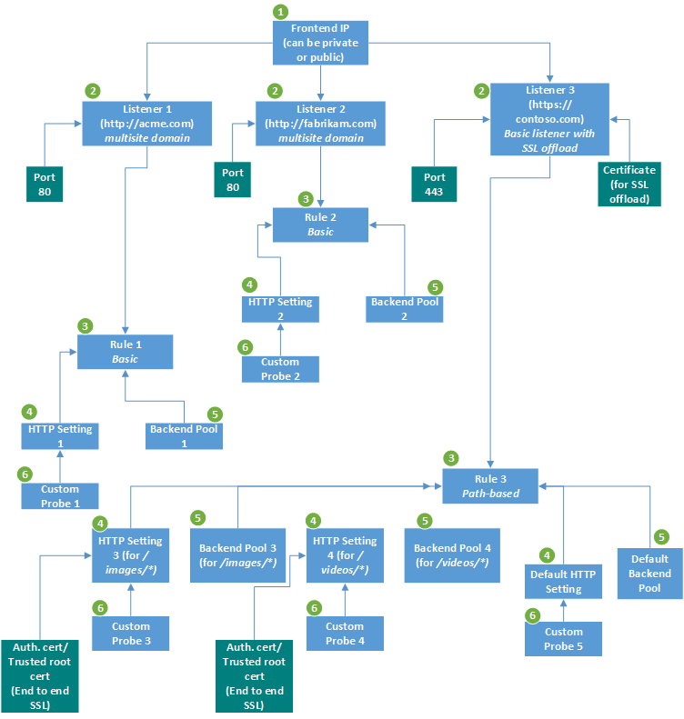
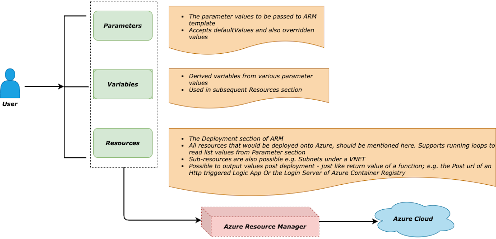

# Deployment Automation of Application Gateway - using ARM/Bicep




​						Ref: [Application Gateway - Complete View](https://docs.microsoft.com/en-us/azure/application-gateway/configuration-overview)

## Introduction

Application Gateway is  a L7 Load Balancer on Azure and full Http(s) Reverse Proxy allowing various features like:

- SSL/TLS termination
- Autoscaling
- Web Application Firewall (WAF)
- URL-based routing
- Multiple-site hosting
- Redirection
- Session affinity
- WebSockets
- Connection draining
- Rewrite HTTP headers and URL

Many of the above features are option based like -

- **Single-site** or **Multi-site** hosting
- **SSL/TLS** termination or SSL **Through**
- **Path-based** routing Or **Basic** Routing

It is most commonly used as the front facing service to multiple backends like *AKS cluster, APIM Management, Azure Firewall, App Services, Serverless-based backends* etc. 

There are various inter-related components involved in application gateway configuration which makes it imperative to have a complete automation of deployment of the same, to make the entire process repetitive, easily configurable and less error-prone.

### What this Article does

- High level overview of the *Application Gateway* components
- Deep insights into ARM template for *Application Gateway* 
- A close look at the Bicep template for *Application Gateway* using nice and useful Decompile feature of Bicep to convert from ARM templates
- A detailed look at the corresponding PowerShell script to make the process smooth and seamless

### What this Article does NOT

- Deep-dive into *Application Gateway* and its associated components and their inter-relations
- Detailed view of how *Application Gateway* works
- Detailed insights into *Application Gateway* flow and features
- Integration of *Application Gateway* with any known backends
- Deep-dive into Bicep


## Plan


Ref: [Application Gateway - How it Works](https://docs.microsoft.com/en-us/azure/application-gateway/how-application-gateway-works)

- ### Application Gateway Components
  - #### Http/s Listeners

    - Listens for all incoming traffics

    - Supports both Http and Https clients

    - Clients that want to connect over Https, should upload the PFX Certificate (*containing the Private Key*) of their DNS server; during the Creation or Initial Configuration of Application Gateway

    - Application Gateway acts as a server for the Client that wants to connect. For Https, it uses the Private Key of PFX certificate to Decrypt message from Clients

    - ##### Basic

      - *Single Tenant*
      - Client wants to connect to only single Backend Pool

    - ##### Multi-Site

      - *Multi Tenant*
      - Same Client wants to connect to multiple backends based on **host-header** or *host-name*

  - #### Http Rules

    - ##### Basic

      - *Single* backend host for the *Associated Listener*
      - *Routing* is handled the backend only (i.e. *in this case inside AKS cluster*); nothing to be decided at the Application Gateway level

    - ##### Path-Based

      - *Route* to appropriate backend based on *Path* parameters
      - Same backend host but different internal paths - */backend/path1, /backend/path2* etc.

  - #### Http Settings

    - Defines Backend Http/S settings

    - ##### Http

      - Client does not want SSL to flow through then it is offloaded at Application Gateway and subsequent communication is *Http*

    - ##### Https

      - SSL to continue till *Backend host*
      - Need to upload **Trusted Toot Certificate** of the *Backend Server*
      - Here Application Gateway acts as the Client and *backend host* acts as the Server

    - ##### Health Probe

      - *Monitors* the health pdf Backend Pool
      - Removes *Unhealthy* resources from Pool automatically and Puts them back when they are *healthy*
      - Consults with *Http Settings* and based on the configuration calls defined health probe route periodically
      - For backend systems like *AKS* or *APIM*, this is imperative that a custom health probe is specified while creating or configuring the Application Gateway

      

- ### ARM Template

  Let us divide the entire template into 3 segments

  - #### Parameters

    - Values to be passed from outside; default values are hard-coded in the template
    - Can be managed within main template as well as in a separate parameters file e.g. **<file_name>.parmeters.json**

  - #### Variables

    - These are the Derived values - from combination of parameters and other variables
    - Used in the [Resources](#Resources) section
    - Makes value assignments easier and concise

  - #### Resources

    - Describes the components of *Application Gateway* to be deployed

    - Dependencies of the components

    - Repetitions of the components, if needed. e.g. *Application Gateway with multi-site hosting would need various components to be deployed multiple times with diff configuration parameters*

    - Conditional deployments, if needed

      

- ### Bicep

  - **Domain** specific Language
  - **Declarative** syntax to deploy resources onto Azure
  - Support for handling **Repetitive** deployments - **for** loops
  - **Conditional** deployments made easy with - **if** check
  - **Modularisation** of the deployment - **module** blocks
  - **Decompilation** feature - Convert existing *ARM* templates to *Bicep* templates


## Action



### ARM Template - Parameters

```json
"parameters":{
      "applicationGatewayName":{
         "type":"string",
         "defaultValue": "[guid(resourceGroup().id)]"
      },
      "vnetName":{
         "type":"string",
         "defaultValue": ""
      },   
      "subnetName":{
         "type":"string",
         "defaultValue": ""
      },
      "skuName": {
        "type": "string",
        "allowedValues": [
           "Standard_Small",
           "Standard_Medium",
           "Standard_Large",
           "Standard_v2",
           "WAF_Large",
           "WAF_Medium",
           "WAF_v2"
        ],
        "defaultValue": "WAF_v2"
      },      
      "minCapacity":{
         "type":"int",
         "defaultValue":2
      },
      "frontendPort":{
         "type":"int",
         "defaultValue":443
      },      
      "frontendProtocol":{
         "type":"string",
         "allowedValues": [
           "Https"
        ],
        "defaultValue": "Https"
      },     
      "backendPort":{
         "type":"int",
         "defaultValue":443
      },
      "backendProtocol":{
         "type":"string",
         "allowedValues": [
           "Http",
           "Https"           
        ],
        "defaultValue": "Https"
      },
      "healthProbeHostName":{
         "type":"string",
         "defaultValue": "test.domain.com"
      },
      "healthProbePath":{
         "type":"string",
         "defaultValue": "/"
      },
      "backendIpAddress": {
        "type": "string",
         "defaultValue":""
      },
      "cookieBasedAffinity":{
         "type":"string",
         "allowedValues":[
            "Enabled",
            "Disabled"
         ],
         "defaultValue":"Disabled"
      },
      "location":{
         "type":"string",
         "defaultValue":"[resourceGroup().location]"
      },   
      "httpsListenerNames": {
            "type": "array",
            "defaultValue": []
      },
      "listenerHostName": {
            "type": "string",
            "defaultValue": "domain.com"
      },
      "backendPoolHostName":{
         "type":"string",
         "defaultValue": "test.internal.testdomain.com"
      },
      "rootCertData":{
         "type": "securestring",
         "defaultValue":""
      },
      "certData":{
         "type": "securestring",
         "defaultValue":""
      },
      "certPassword": {
         "type": "securestring",
         "defaultValue":""
      }
   }
```


Let us look at the important parameters here

#### ARM Template - Listeners

```json
"frontendPort":{
  "type":"int",
  "defaultValue":443
},      
"frontendProtocol":{
  "type":"string",
  "allowedValues": [
    "Https"
  ],
  "defaultValue": "Https"
}
....
"httpsListenerNames": {
  "type": "array",
  "defaultValue": []
},
"listenerHostName": {
  "type": "string",
  "defaultValue": "domain.com"
},
```

- **Https** Listeners

- **Port** 443

- Passing **Listener** names in an array

- **Listener Host Name** is the DNS server address appended to the *httpsListenerNames* array

- Supports **Multi Tenancy** i.e. multi-site hosting. Same *Application Gateway* IP would be used for multiple tenants (sites)

  e.g. Assume following:

  - Two tenants - *tenant-A, tenant-B* passed as arguments in *httpsListenerNames* array
  - IP address of *Application Gateway* - xx.xx.xx.xx
  - DNS server of the User as - **.<dns_name>.com*
    - listenerHostName is passed as *domain.com*

- The *Https Listeners* would then be

  - **tenant-A.domain.com**
  - **tenant-B.domain.com**

#### ARM Template - Backend

```json
"backendPort":{
  "type":"int",
  "defaultValue":443
},
"backendProtocol":{
  "type":"string",
  "allowedValues": [
    "Http",
    "Https"           
  ],
  "defaultValue": "Https"
}
.....
.....
"backendIpAddress": {
  "type": "string",
  "defaultValue":""
},
"backendPoolHostName":{
  "type":"string",
  "defaultValue": "test.internal.testdomain.com"
}
```

- **Https** Backend i.e. no *SSL/TLS* termination at *Application Gateway*

- Either of *backendIpAddress* Or *backendPoolHostName* need to be specified

- For **SSL/TLS** termination this should look like following

  ```json
  "backendPort":{
    "type":"int",
    "defaultValue":80
  },
  "backendProtocol":{
    "type":"string",
    "allowedValues": [
      "Http",
      "Https"           
    ],
    "defaultValue": "Http"
  }
  ....
  ....
  "backendIpAddress": {
    "type": "string",
    "defaultValue":""
  },
  "backendPoolHostName":{
    "type":"string",
    "defaultValue": "test.internal.testdomain.com"
  }
  ```

#### ARM Template - Health Probe

```json
"healthProbeHostName":{
  "type":"string",
  "defaultValue": "test.domain.com"
},
"healthProbePath":{
  "type":"string",
  "defaultValue": "/"
}
```

- Checks Health Probe of the backend periodically
- Removes UnHealthy backends from list in a separate queue; until they become healthy again. Returns 502
- Front end application can program accordingly to check for 5xx error codes and take appropriate actions
- Health Probe protocol would be nothing but the backend Protocol passed as an argument in [Parameters](#ARM Template - Parameters) 

#### ARM Template - Secure Data

```js
"rootCertData":{
  "type": "securestring",
    "defaultValue":""
},
  "certData":{
    "type": "securestring",
      "defaultValue":""
  },
    "certPassword": {
      "type": "securestring",
        "defaultValue":""
    }
```

- **rootCertData** - **CER** Certificate data for *Https Backend*

- **certData** - **PFX** Certificate data for Https Frontend (i.e. *Listeners*)

- **certPassword** - PFX Certificate password

- Values for all the 3 would come from **KeyVault**. The KeyVault entries should be specified in separate parameters fie:

  

  #### ARM Template - Parameters file

  ```json
  {
    "$schema": "https://schema.management.azure.com/schemas/2015-01-01/deploymentParameters.json#",
    "contentVersion": "1.0.0.0",    
    "parameters": {
        "rootCertData": {
          "reference": {
              "keyVault": {
                  "id": "<keyVault_id>"
                },
            "secretName": "<secret_Name>"
        }
      },
        "certData": {
          "reference": {
              "keyVault": {
                  "id": "<keyVault_id>"
                },
            "secretName": "<secret_Name>"
        }
      },
      "certPassword": {
          "reference": {
              "keyVault": {
                  "id": "<keyVault_id>"
                },
            "secretName": "<secret_Name>"
        }
      }
    }
  }
  ```


### ARM Template - Variables

```json
"variables":{
      "appGwId": "[resourceId('Microsoft.Network/applicationGateways', parameters('applicationGatewayName'))]",
      "appGwIPConfigName":"[concat(parameters('applicationGatewayName'), '-ipc')]",
      "appGwPublicIpName":"[concat(parameters('applicationGatewayName'), '-pip')]",
      "appGwFrontendIPConfigName":"[concat(parameters('applicationGatewayName'), '-fre-ipc')]",
      "appGwFrontendPortName":"[concat(parameters('applicationGatewayName'), '-fre-port')]",      
      "appGwBackendPoolName":"[concat(parameters('applicationGatewayName'), '-bkend-pool')]",
      "appGwHttpsListenerName":"[concat(parameters('applicationGatewayName'), '-https-listener')]",      
      "appGwHttpsListenerHostName":"[parameters('listenerHostName')]",
      "appGwSSLCertName":"[concat(parameters('applicationGatewayName'), '-ssl-cert')]",
      "appGwSSLCertId":
      {

         "Id": "[concat(variables('appGwId'), '/sslCertificates/', variables('appGwSSLCertName'))]"
      },
      "appGwBackendHttpSettingsName":"[concat(parameters('applicationGatewayName'), '-bkend-http-settings')]",
      "appGwBackendHttpSettingsHostName":"[parameters('backendPoolHostName')]",
      "appGwHttpsRuleName":"[concat(parameters('applicationGatewayName'), '-rule')]",      
      "appGwProbeName":"[concat(parameters('applicationGatewayName'), '-health-probe')]",
      "subnetRef":"[resourceId('Microsoft.Network/virtualNetworks/subnets', parameters('vnetName'), parameters('subnetName'))]",
      "appGwPublicIPRef":"[resourceId('Microsoft.Network/publicIPAddresses', variables('appGwPublicIpName'))]",
      "appGwProbeRef":"[concat(variables('appGwId'), '/probes/', variables('appGwProbeName'))]",
      "appGwSize":"[parameters('skuName')]",
      "appGwTier":"[parameters('skuName')]",
      "appGwTrustedRootCertName":"[concat(parameters('applicationGatewayName'), '-root-cert')]"
   }
```


### ARM Template - Resources

#### Public IP Address

```json
{
    "apiVersion":"2020-05-01",
    "type":"Microsoft.Network/publicIPAddresses",
    "name":"[variables('appGwPublicIpName')]",
    "location":"[parameters('location')]",
    "sku":{
    	"name":"Standard"
    },
    "properties":{
    "publicIPAllocationMethod":"Static"
  }
}
```

- The **Static Public IP** of *Application Gateway*

#### Application Gateway

```json
{
  "apiVersion":"2020-05-01",
  "name":"[parameters('applicationGatewayName')]",
  "type":"Microsoft.Network/applicationGateways",
  "location":"[parameters('location')]",
  "dependsOn":[
  	"[variables('appGwPublicIPRef')]"
  ],
```

- Dependency on *Public IP* reference

```json
"properties":{
 	"copy":[
    .......
```

- **Copy** makes it possible to repeat deployment of multiple components

  - Each block has:

    - name
    - count - items on the array or no. of repetitions
    - input - the item to be repeated

  - ##### Backend Http Settings

  ```json
  {
    "name": "backendHttpSettingsCollection",
    "count": "[length(parameters('httpsListenerNames'))]",
    "input":
    {
  
      "name": "[concat(parameters('httpsListenerNames')[copyIndex('backendHttpSettingsCollection')], '-', variables('appGwBackendHttpSettingsName'))]",
      "properties":
      {
  
        "Port":"[parameters('backendPort')]",
        "Protocol":"[parameters('backendProtocol')]",
        "CookieBasedAffinity":"[parameters('cookieBasedAffinity')]",
        "hostName": "[concat(parameters('httpsListenerNames')[copyIndex('backendHttpSettingsCollection')], variables('appGwBackendHttpSettingsHostName'))]",
        "probeEnabled": true,
        "probe":
        {
          "id": "[variables('appGwProbeRef')]"
        },
        "trustedRootCertificates": [
          {
            "Id": "[concat(variables('appGwId'), '/trustedRootCertificates/', variables('appGwTrustedRootCertName'))]"
          }]
      }
    }
  }
  ```

  - ##### Http Listeners

  ```json
  {
    "name": "httpListeners",
    "count": "[length(parameters('httpsListenerNames'))]",
    "input":
      {
  
          "name":"[concat(parameters('httpsListenerNames')[copyIndex('httpListeners')], '-', variables('appGwHttpsListenerName'))]",
          "properties":
            {
  
              "FrontendIpConfiguration":{
              "Id":"[concat(variables('appGwId'), '/frontendIPConfigurations/', variables('appGwFrontendIPConfigName'))]"
              },
              "FrontendPort":{
              "Id":"[concat(variables('appGwId'), '/frontendPorts/', variables('appGwFrontendPortName'))]"
              },
              "Protocol":"[parameters('frontendProtocol')]",
              "SslCertificate":"[variables('appGwSSLCertId')]",  
              "hostName": "[concat(parameters('httpsListenerNames')[copyIndex('httpListeners')], variables('appGwHttpsListenerHostName'))]"
          }
      }
    }
  ```

  - ##### Request Routing Rules

  ```json
  {
    "name": "requestRoutingRules",
    "count": "[length(parameters('httpsListenerNames'))]",
    "input":
      {
          "name":"[concat(parameters('httpsListenerNames')[copyIndex('requestRoutingRules')], '-', variables('appGwHttpsRuleName'))]",
          "properties":
            {
                "RuleType": "Basic",
                "httpListener": {
                  "id": "[resourceId('Microsoft.Network/applicationGateways/httpListeners', parameters('applicationGatewayName'), concat(parameters('httpsListenerNames')[copyIndex('requestRoutingRules')], '-', variables('appGwHttpsListenerName')))]"
                },
                "backendAddressPool": {
                  "id": "[resourceId('Microsoft.Network/applicationGateways/backendAddressPools', parameters('applicationGatewayName'), variables('appGwBackendPoolName'))]"
                },                        
                "backendHttpSettings": {
                  "id": "[resourceId('Microsoft.Network/applicationGateways/backendHttpSettingsCollection', parameters('applicationGatewayName'), concat(parameters('httpsListenerNames')[copyIndex('requestRoutingRules')], '-', variables('appGwBackendHttpSettingsName')))]"
              }
        }
    }
  ```

  - ##### Entire *Resources* section

  ```json
  [
        {
           "apiVersion":"2020-05-01",
           "type":"Microsoft.Network/publicIPAddresses",
           "name":"[variables('appGwPublicIpName')]",
           "location":"[parameters('location')]",
           "sku":{
              "name":"Standard"
           },
           "properties":{
              "publicIPAllocationMethod":"Static"
           }
        },
        {
           "apiVersion":"2020-05-01",
           "name":"[parameters('applicationGatewayName')]",
           "type":"Microsoft.Network/applicationGateways",
           "location":"[parameters('location')]",
           "dependsOn":[
              "[variables('appGwPublicIPRef')]"
           ],
           "properties":{
              "copy":[
              {
                 "name": "backendHttpSettingsCollection",
                 "count": "[length(parameters('httpsListenerNames'))]",
                 "input":
                 {
  
                    "name": "[concat(parameters('httpsListenerNames')[copyIndex('backendHttpSettingsCollection')], '-', variables('appGwBackendHttpSettingsName'))]",
                    "properties":
                    {
  
                       "Port":"[parameters('backendPort')]",
                       "Protocol":"[parameters('backendProtocol')]",
                       "CookieBasedAffinity":"[parameters('cookieBasedAffinity')]",
                       "hostName": "[concat(parameters('httpsListenerNames')[copyIndex('backendHttpSettingsCollection')], variables('appGwBackendHttpSettingsHostName'))]",
                       "probeEnabled": true,
                       "probe":
                       {
                          "id": "[variables('appGwProbeRef')]"
                       },
                       "trustedRootCertificates": [
                       {
                          "Id": "[concat(variables('appGwId'), '/trustedRootCertificates/', variables('appGwTrustedRootCertName'))]"
                       }]
                    }
                 }
              },
              {
                 "name": "httpListeners",
                 "count": "[length(parameters('httpsListenerNames'))]",
                 "input":
                 {
  
                    "name":"[concat(parameters('httpsListenerNames')[copyIndex('httpListeners')], '-', variables('appGwHttpsListenerName'))]",
                    "properties":
                    {
  
                       "FrontendIpConfiguration":{
                          "Id":"[concat(variables('appGwId'), '/frontendIPConfigurations/', variables('appGwFrontendIPConfigName'))]"
                       },
                       "FrontendPort":{
                          "Id":"[concat(variables('appGwId'), '/frontendPorts/', variables('appGwFrontendPortName'))]"
                       },
                       "Protocol":"[parameters('frontendProtocol')]",
                       "SslCertificate":"[variables('appGwSSLCertId')]",  
                       "hostName": "[concat(parameters('httpsListenerNames')[copyIndex('httpListeners')], variables('appGwHttpsListenerHostName'))]"
                    }
                 }
              },
              {
                 "name": "requestRoutingRules",
                 "count": "[length(parameters('httpsListenerNames'))]",
                 "input":
                 {
  
                    "name":"[concat(parameters('httpsListenerNames')[copyIndex('requestRoutingRules')], '-', variables('appGwHttpsRuleName'))]",
                    "properties":
                    {
  
                       "RuleType": "Basic",
                       "httpListener": {
                          "id": "[resourceId('Microsoft.Network/applicationGateways/httpListeners', parameters('applicationGatewayName'), concat(parameters('httpsListenerNames')[copyIndex('requestRoutingRules')], '-', variables('appGwHttpsListenerName')))]"
                       },
                       "backendAddressPool": {
                          "id": "[resourceId('Microsoft.Network/applicationGateways/backendAddressPools', parameters('applicationGatewayName'), variables('appGwBackendPoolName'))]"
                       },                        
                       "backendHttpSettings": {
                          "id": "[resourceId('Microsoft.Network/applicationGateways/backendHttpSettingsCollection', parameters('applicationGatewayName'), concat(parameters('httpsListenerNames')[copyIndex('requestRoutingRules')], '-', variables('appGwBackendHttpSettingsName')))]"
                       }
                    }
                 }
              }],
              "sku":{
                 "name":"[variables('appGwSize')]",
                 "tier":"[variables('appGwTier')]"
              },
              "autoscaleConfiguration":{
                 "minCapacity":"[parameters('minCapacity')]"
              },
              "trustedRootCertificates": [
              {      
                    "name": "[variables('appGwTrustedRootCertName')]",
                    "properties": {                     
                       "data": "[parameters('rootCertData')]"
                    }
                 }
              ],
              "sslCertificates": [{
                 "name": "[variables('appGwSSLCertName')]",
                 "properties": {
                    "data": "[parameters('certData')]",
                    "password": "[parameters('certPassword')]"
                    }
                 }
              ],
              "gatewayIPConfigurations":[
                 {
                    "name":"[variables('appGwIPConfigName')]",
                    "properties":{
                       "subnet":{
                          "id":"[variables('subnetRef')]"
                       }
                    }
                 }
              ],
              "frontendIPConfigurations":[
                 {
                    "name":"[variables('appGwFrontendIPConfigName')]",
                    "properties":{
                       "PublicIPAddress":{
                          "id":"[variables('appGwPublicIpRef')]"
                       }
                    }
                 }
              ],
              "frontendPorts":[
                 {
                    "name":"[variables('appGwFrontendPortName')]",
                    "properties":{
                       "Port":"[parameters('frontendPort')]"
                    }
                 }               
              ],
              "probes": [
                 {
                    "name": "[variables('appGwProbeName')]",
                    "properties": {
                       "protocol": "[parameters('backendProtocol')]",
                       "path": "[parameters('healthProbePath')]",
                       "interval": 30,
                       "timeout": 30,
                       "unhealthyThreshold": 3,
                       "pickHostNameFromBackendHttpSettings": false,
                       "host": "[parameters('healthProbeHostName')]",
                       "port": "[parameters('backendPort')]"
                    }
                 }
              ],
              "backendAddressPools":[
                 {
                    "name":"[variables('appGwBackendPoolName')]",
                    "properties":{
                          "BackendAddresses":[{
                             "ipAddress": "[parameters('backendIpAddress')]"
                          }]
                    }
                 }
              ]            
           }         
        }       
     ]
  ```


### Quick Look - Bicep Template

How does the whole thing look on Bicep? It is actually more concise, nice and easy to manage

#### Bicep - Parameters

```powershell
param applicationGatewayName string = guid(resourceGroup().id)
param vnetName string = ''
param subnetName string = ''

@allowed([
  'Standard'  
  'Standard_v2'
  'WAF'  
  'WAF_v2'
])
param tierSkuName string = 'WAF_v2'

@allowed([
  'Standard_Small'
  'Standard_Medium'
  'Standard_Large'
  'Standard_v2'
  'WAF_Large'
  'WAF_Medium'
  'WAF_v2'
])
param sizeSkuName string = 'WAF_v2'

param minCapacity int = 2
param frontendPort int = 443

@allowed([
  'Https'
])
param frontendProtocol string = 'Https'
param backendPort int = 443

@allowed([
  'Http'
  'Https'
])
param backendProtocol string = 'Https'
param healthProbeHostName string = 'test.domain.com'
param healthProbePath string = '/'
param backendIpAddress string = ''

@allowed([
  'Enabled'
  'Disabled'
])
param cookieBasedAffinity string = 'Disabled'
param location string = resourceGroup().location
param httpsListenerNames array = []
param listenerHostName string = '.domain.com'
param backendPoolHostName string = '.internal.testdomain.com'

@secure()
param rootCertData string

@secure()
param certData string

@secure()
param certPassword string
```

- Nice and programmatic way of declaring parameters and their default values

- **@allowed** - for restricting values fro variables

- **@secure** - for declaring secured values

  

#### Bicep - Variables

```powershell
var appGwId = resourceId('Microsoft.Network/applicationGateways', '${applicationGatewayName}')
var appGwIPConfigName = '${applicationGatewayName}-ipc'
var appGwPublicIpName_var = '${applicationGatewayName}-pip'
var appGwFrontendIPConfigName = '${applicationGatewayName}-fre-ipc'
var appGwFrontendPortName = '${applicationGatewayName}-fre-port'
var appGwBackendPoolName = '${applicationGatewayName}-bkend-pool'
var appGwHttpsListenerName = '${applicationGatewayName}-https-listener'
var appGwHttpsListenerHostName = listenerHostName
var appGwSSLCertName = '${applicationGatewayName}-ssl-cert'
var appGwSSLCertId = {
  id: '${appGwId}/sslCertificates/${appGwSSLCertName}'
}
var appGwBackendHttpSettingsName = '${applicationGatewayName}-bkend-http-settings'
var appGwBackendHttpSettingsHostName = backendPoolHostName
var appGwHttpsRuleName = '${applicationGatewayName}-rule'
var appGwProbeName = '${applicationGatewayName}-health-probe'
var subnetRef = resourceId('Microsoft.Network/virtualNetworks/subnets', vnetName, subnetName)
var appGwPublicIPRef = appGwPublicIpName.id
var appGwProbeRef = '${appGwId}/probes/${appGwProbeName}'
var appGwSize = sizeSkuName
var appGwTier = tierSkuName
var appGwTrustedRootCertName = '${applicationGatewayName}-root-cert'
```


#### Bicep - Resources

##### Public IP

```powershell
resource appGwPublicIpName 'Microsoft.Network/publicIPAddresses@2020-05-01' = {
  name: appGwPublicIpName_var
  location: location
  sku: {
    name: 'Standard'
  }
  properties: {
    publicIPAllocationMethod: 'Static'
  }
}
```

##### Application Gateway 

```powershell
resource applicationGatewayName_resource 'Microsoft.Network/applicationGateways@2020-05-01' = {
  name: applicationGatewayName
  location: location
  properties: {
  ......
```

##### Backend Http Settings

```powershell
backendHttpSettingsCollection: [for item in httpsListenerNames: {
      name: '${item}-${appGwBackendHttpSettingsName}'
      properties: {
        port: backendPort
        protocol: backendProtocol
        cookieBasedAffinity: cookieBasedAffinity
        hostName: '${item}${appGwBackendHttpSettingsHostName}'
        probeEnabled: true
        probe: {
          id: appGwProbeRef
        }
        trustedRootCertificates: [
          {
            id: '${appGwId}/trustedRootCertificates/${appGwTrustedRootCertName}'
          }
        ]
      }
}]
```

##### Http Listeners

```powershell
httpListeners: [for item in httpsListenerNames: {
      name: '${item}-${appGwHttpsListenerName}'
      properties: {
        frontendIPConfiguration: {
          id: '${appGwId}/frontendIPConfigurations/${appGwFrontendIPConfigName}'
        }
        frontendPort: {
          id: '${appGwId}/frontendPorts/${appGwFrontendPortName}'
        }
        protocol: frontendProtocol
        sslCertificate: appGwSSLCertId
        hostName: '${item}${appGwHttpsListenerHostName}'
      }
}]
```

##### Request Routing rules

```powershell
requestRoutingRules: [for item in httpsListenerNames: {
      name: '${item}-${appGwHttpsRuleName}'
      properties: {
        ruleType: 'Basic'
        httpListener: {
          id: resourceId('Microsoft.Network/applicationGateways/httpListeners', applicationGatewayName, '${item}-${appGwHttpsListenerName}')
        }
        backendAddressPool: {
          id: resourceId('Microsoft.Network/applicationGateways/backendAddressPools', applicationGatewayName, appGwBackendPoolName)
        }
        backendHttpSettings: {
          id: resourceId('Microsoft.Network/applicationGateways/backendHttpSettingsCollection', applicationGatewayName, '${item}-${appGwBackendHttpSettingsName}')
        }
}
```


#### Entire Resources Section

```powershell
resource appGwPublicIpName 'Microsoft.Network/publicIPAddresses@2020-05-01' = {
  name: appGwPublicIpName_var
  location: location
  sku: {
    name: 'Standard'
  }
  properties: {
    publicIPAllocationMethod: 'Static'
  }
}

resource applicationGatewayName_resource 'Microsoft.Network/applicationGateways@2020-05-01' = {
  name: applicationGatewayName
  location: location
  properties: {
    backendHttpSettingsCollection: [for item in httpsListenerNames: {
      name: '${item}-${appGwBackendHttpSettingsName}'
      properties: {
        port: backendPort
        protocol: backendProtocol
        cookieBasedAffinity: cookieBasedAffinity
        hostName: '${item}${appGwBackendHttpSettingsHostName}'
        probeEnabled: true
        probe: {
          id: appGwProbeRef
        }
        trustedRootCertificates: [
          {
            id: '${appGwId}/trustedRootCertificates/${appGwTrustedRootCertName}'
          }
        ]
      }
    }]
    httpListeners: [for item in httpsListenerNames: {
      name: '${item}-${appGwHttpsListenerName}'
      properties: {
        frontendIPConfiguration: {
          id: '${appGwId}/frontendIPConfigurations/${appGwFrontendIPConfigName}'
        }
        frontendPort: {
          id: '${appGwId}/frontendPorts/${appGwFrontendPortName}'
        }
        protocol: frontendProtocol
        sslCertificate: appGwSSLCertId
        hostName: '${item}${appGwHttpsListenerHostName}'
      }
    }]
    requestRoutingRules: [for item in httpsListenerNames: {
      name: '${item}-${appGwHttpsRuleName}'
      properties: {
        ruleType: 'Basic'
        httpListener: {
          id: resourceId('Microsoft.Network/applicationGateways/httpListeners', applicationGatewayName, '${item}-${appGwHttpsListenerName}')
        }
        backendAddressPool: {
          id: resourceId('Microsoft.Network/applicationGateways/backendAddressPools', applicationGatewayName, appGwBackendPoolName)
        }
        backendHttpSettings: {
          id: resourceId('Microsoft.Network/applicationGateways/backendHttpSettingsCollection', applicationGatewayName, '${item}-${appGwBackendHttpSettingsName}')
        }
      }
    }]
    sku: {
      name: appGwSize
      tier: appGwTier
    }
    autoscaleConfiguration: {
      minCapacity: minCapacity
    }
    trustedRootCertificates: [
      {
        name: appGwTrustedRootCertName
        properties: {
          data: rootCertData
        }
      }
    ]
    sslCertificates: [
      {
        name: appGwSSLCertName
        properties: {
          data: certData
          password: certPassword
        }
      }
    ]
    gatewayIPConfigurations: [
      {
        name: appGwIPConfigName
        properties: {
          subnet: {
            id: subnetRef
          }
        }
      }
    ]
    frontendIPConfigurations: [
      {
        name: appGwFrontendIPConfigName
        properties: {
          publicIPAddress: {
            id: appGwPublicIPRef
          }
        }
      }
    ]
    frontendPorts: [
      {
        name: appGwFrontendPortName
        properties: {
          port: frontendPort
        }
      }
    ]
    probes: [
      {
        name: appGwProbeName
        properties: {
          protocol: backendProtocol
          path: healthProbePath
          interval: 30
          timeout: 30
          unhealthyThreshold: 3
          pickHostNameFromBackendHttpSettings: false
          host: healthProbeHostName
          port: backendPort
        }
      }
    ]
    backendAddressPools: [
      {
        name: appGwBackendPoolName
        properties: {
          backendAddresses: [
            {
              ipAddress: backendIpAddress
            }
          ]
        }
      }
    ]
  }
  dependsOn: [
    appGwPublicIpName
  ]
}
```


### Transition to Bicep from *ARM*

Exiting ARM users can move to Bicep template easily using Decompilation feature of the *Bicep Extension* fo Azure CLI

#### Decompilation

**Bicep** extension for Azure CLI need t be installed/upgarded

```bash
az bicep install
```

```bash
az bicep upgrade
```

**Decompile** from ARM template to *Bicep*

```bash
az bicep decompile -f <file_name>
```

**Deploy** Template 

```bash
applicationGatewayName="<appgw_name>"
keyVaultName="<kv_name>"
vnetName="<vnet_name>"
appgwSubnetName="<appgw_subnet_name>"
httpsListenerNames='<https_listener_name>'
backendIpAddress="<backend_Ip_Address>"
```

```bash
az deployment group create -f ./aksauto-appgw-deploy.bicep -g arm-workshop-rg \
--parameters @./aksauto-appgw-deploy.parameters.json \
--parameters applicationGatewayName=$applicationGatewayName \
--parameters vnetName=$vnetName --parameters subnetName=$appgwSubnetName \
--parameters httpsListenerNames=$httpsListenerNames \
--parameters backendIpAddress=$backendIpAddress
```


## Summary

The intention of this article was to give a detailed view of ARM as well as Bicep templates to perform Deployment Automation of Application Gateway, which can hide all the complexities, various associated components and their inter-relations.

Alternative tools like **Terraform** with *Azure  Provider* is quite popular and provides a very good, descriptive, secure way of deploying the resources on Azure. But as we have seen with the entry of **Bicep** as *IaC* language has made deployment of resources on Azure much easier, flexible and manageable now.


## References

- ###### Application Gateway Docs - https://docs.microsoft.com/en-us/azure/application-gateway/

- ###### **Application Gateway Bicep/ARM** - https://docs.microsoft.com/en-us/azure/templates/microsoft.network/applicationgateways?tabs=bicep

- ###### **Learn Bicep** - https://docs.microsoft.com/en-us/azure/azure-resource-manager/bicep/

- ###### **Source Repo** - https://github.com/monojit18/ARM-Projects.git

